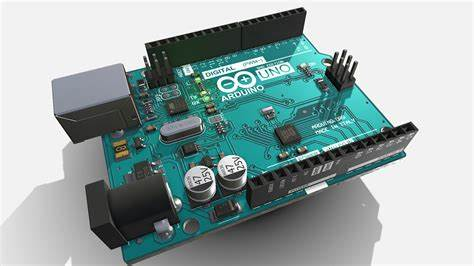
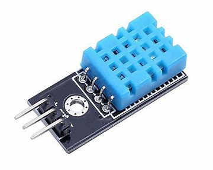
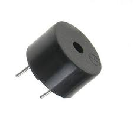
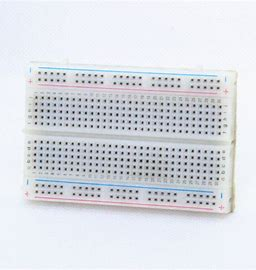
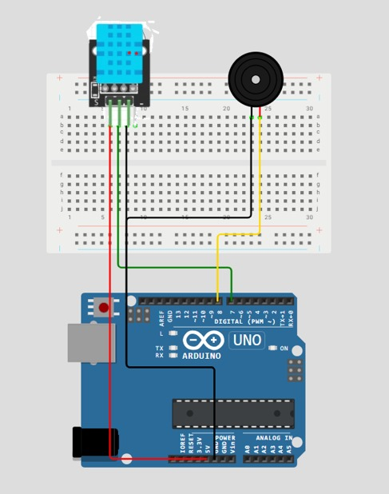
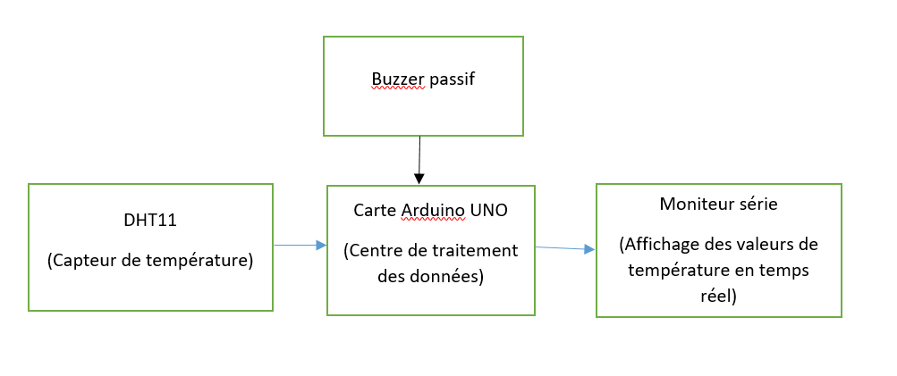

# La Crypte du Souffle Vital

## Présentation du Projet

Tu avances prudemment dans une **crypte ancienne**, où **l'air est lourd** et chargé d'un **silence inquiétant**. Devant toi, un autel de pierre recouvert de symboles oubliés. Au centre repose un **mystérieux artefact** qui semble endormi: un petit cristal relié à une étrange boîte sonore.
Tu t'approches et lis l'inscription gravée sur la pierre:
"**Seul le souffle des étoiles révélera la mélodie.**"
Soudain, une faible lueur émane du cristal. C'est un capteur ancien, conçu pour réagir à la **température ambiante**. Mais l'air brûlant de la crypte l'a scellé dans un état de dormance.
Tu comprends alors: **si tu peux refroidir l'artefact en soufflant dessus, il révélera son chant sacré...**


## Fonctionnement :
### Fonctionnement du défi
- Le **capteur DHT11** mesure la température en continu.
- Si **Température < 22°C** → Le système détecte l'anormalie.
- Le buzzer s'active pour jouer la **mélodie "Frère Jacques"** pour indiquer que l'enigme est résolu.
- Si la température est élevé, rien ne se passe .

### Fonctionnement du Bonus

- **Mode Temps Limité:** La température doit descendre sous 22°C en moins de 30 secondes, sinon la crypte se referme et la mélodie est perdue!
- **Mode Son Mystique :** Ajoute une deuxième mélodie cachée qui ne se joue qu'à 20°C ou moins.
- **Mode Indices Anciens:** Affiche la température en direct sur le moniteur série pour aider les aventuriers à ajuster leur souffle.
- **Mode Inverse:** L'Épreuve de la Flamme Sacrée : Modifie le code pour détecter une température élevée (ex: frotter le capteur avec les doigts pour monter à 30°C et déclencher une autre mélodie).

---

## Liste du Matériel

| Composant             | Modèle         | Quantité | 
|----------------------|---------------|----------|
| Carte Arduino       | Arduino UNO    | 1        |
| Capteur de température | DHT11         | 1        |
| Buzzer             | Buzzer passif   | 1        |
| Breadboard         | -              | 1        |
| Fils de connexion  | Jumpers        | Plusieurs |

---

## Caractéristiques Techniques

### Carte Arduino UNO

  

- **Microcontrôleur** : ATmega328P  
- **Tension de fonctionnement** : 5V  
- **Tension d'entrée recommandée** : 7-12V  
- **Courant max par broche d'E/S** : 40 mA  
- **Fréquence d'horloge** : 16 MHz  

### Capteur de Température DHT11
  
- **Tension d'alimentation** : 3.3V - 5V  
- **Plage de température** : 0°C à 50°C  
- **Précision** : ±2°C  
- **Plage d'humidité** : 20% à 90% RH  

### Buzzer Passif
  
- **Tension de fonctionnement** : 3.3V - 5V  
- **Courant nominal** : 10-30 mA  
- **Fréquence de résonance** : ~2 kHz  

### Breadboard (Plaque d'essai)
    
- **Courant max par rangée** : 1A  
- **Tension max** : 300V  

### Fils de Connexion (Jumpers)
  
- **Courant max supporté** : 1-3A  
- **Longueur** : 10-30 cm  

---

## Logiciel et Programmation

- **Logiciel** : Arduino IDE
- **Langage de programmation** : Arduino (C++)

---

## Schémas
### Schéma électrique du projet


### Schéma synoptique du projet


---

## Codes Arduino
### Code Arduino du Défis
```cpp
#include <dht11.h>

#define DHT11PIN 7
#define SPEAKER_PIN 8

dht11 DHT11;

// Fréquences des notes en Hz
#define NOTE_DO  262
#define NOTE_RE  294
#define NOTE_MI  330
#define NOTE_FA  349
#define NOTE_SOL 392
#define NOTE_LA  440

// Mélodie "Frère Jacques"
int melody[] = {
  NOTE_DO, NOTE_RE, NOTE_MI, NOTE_DO,
  NOTE_DO, NOTE_RE, NOTE_MI, NOTE_DO,
  NOTE_MI, NOTE_FA, NOTE_SOL,
  NOTE_MI, NOTE_FA, NOTE_SOL
};

// Durées des notes (en ms)
int noteDurations[] = {500, 500, 500, 500, 500, 500, 500, 500, 500, 500, 1000, 500, 500, 1000};

void playMelodyFJ() {
  int length = sizeof(melody) / sizeof(melody[0]);
  for (int i = 0; i < length; i++) {
    tone(SPEAKER_PIN, melody[i], noteDurations[i]);
    delay(noteDurations[i] * 1.30);
  }
}

void setup() {
  Serial.begin(9600);
  pinMode(SPEAKER_PIN, OUTPUT);
}

void loop() {
  float temperature = (float) DHT11.temperature;
  Serial.print("Température (°C) : ");
  Serial.println(temperature, 2);
  delay(1000);

  if (temperature < 22) {
    playMelodyFJ();
  } else {
    noTone(SPEAKER_PIN);
  }
}
```
### Code Arduino du Bonus

```cpp
#include <dht11.h>
#define DHT11PIN 7
#define SPEAKER_PIN 8

dht11 DHT11;

// Fréquences des notes en Hz
#define NOTE_DO  262
#define NOTE_RE  294
#define NOTE_MI  330
#define NOTE_FA  349
#define NOTE_SOL 392
#define NOTE_LA  440

// Mélodie de "Frère Jacques"
int melody[] = {
  NOTE_DO, NOTE_RE, NOTE_MI, NOTE_DO,
  NOTE_DO, NOTE_RE, NOTE_MI, NOTE_DO,
  NOTE_MI, NOTE_FA, NOTE_SOL,
  NOTE_MI, NOTE_FA, NOTE_SOL,
  NOTE_SOL, NOTE_LA, NOTE_SOL, NOTE_FA, NOTE_MI, NOTE_DO,
  NOTE_SOL, NOTE_LA, NOTE_SOL, NOTE_FA, NOTE_MI, NOTE_DO,
  NOTE_DO, NOTE_SOL, NOTE_DO,
  NOTE_DO, NOTE_SOL, NOTE_DO
};

// Durées des notes (en ms)
int noteDurations[] = {
  500, 500, 500, 500,
  500, 500, 500, 500,
  500, 500, 1000,
  500, 500, 1000,
  250, 250, 250, 250, 500, 500,
  250, 250, 250, 250, 500, 500,
  250, 250, 500,
  250, 250, 500
};

// Fréquences des notes
#define NOTE1_DO  262
#define NOTE1_RE  294
#define NOTE1_MI  330
#define NOTE1_FA  349
#define NOTE1_SOL 392
#define NOTE1_LA  440
#define NOTE1_SI  494
#define NOTE1_DO_HIGH  523  // Do de l'octave supérieure

// Mélodie "Happy Birthday"
int melody1[] = {
  NOTE1_SOL, NOTE1_SOL, NOTE1_LA, NOTE1_SOL, NOTE1_DO_HIGH, NOTE1_SI,
  NOTE1_SOL, NOTE1_SOL, NOTE1_LA, NOTE1_SOL, NOTE1_RE, NOTE1_DO_HIGH,
  NOTE1_SOL, NOTE1_SOL, NOTE1_SOL, NOTE1_MI, NOTE1_DO_HIGH, NOTE1_SI, NOTE1_LA,
  NOTE1_FA, NOTE1_FA, NOTE1_MI, NOTE1_DO_HIGH, NOTE1_RE, NOTE1_DO_HIGH
};

// Durées des notes (plus rapides)
int noteDurations1[] = {
  300, 300, 600, 600, 600, 900,
  300, 300, 600, 600, 600, 900,
  300, 300, 300, 300, 300, 300, 600,
  300, 300, 300, 300, 600, 900
};


// Fréquences des notes
#define NOTE2_DO  262
#define NOTE2_RE  294
#define NOTE2_MI  330
#define NOTE2_FA  349
#define NOTE2_SOL 392
#define NOTE2_LA  440
#define NOTE2_SI  494

// Mélodie "Au clair de la lune"
int melody2[] = {
  NOTE2_DO, NOTE2_RE, NOTE2_MI, NOTE2_RE, NOTE2_DO,
  NOTE2_MI, NOTE2_RE, NOTE2_RE, NOTE2_DO, NOTE2_DO,
  NOTE2_RE, NOTE2_MI, NOTE2_RE, NOTE2_DO, NOTE2_MI,
  NOTE2_RE, NOTE2_RE, NOTE2_DO, NOTE2_RE, NOTE2_RE,
  NOTE2_RE, NOTE2_LA, NOTE2_LA, NOTE2_RE, NOTE2_DO,
  NOTE2_SI, NOTE2_LA, NOTE2_SOL, NOTE2_DO, NOTE2_DO,
  NOTE2_RE, NOTE2_MI, NOTE2_RE, NOTE2_DO, NOTE2_MI,
  NOTE2_RE, NOTE2_RE, NOTE2_DO
};

// Durées des notes (en millisecondes)
int noteDurations2[] = {
  500, 250, 250, 250, 700, // Première phrase
  250, 250, 250, 250, 700, // Deuxième phrase
  250, 250, 250, 250, 250, // Troisième phrase
  250, 250, 250, 250, 700, // Quatrième phrase
  250, 250, 250, 250, 700, // Cinquième phrase
  250, 250, 250, 250, 700, // Sixième phrase
  250, 250, 250, 250, 700, // Septième phrase
  250, 250, 250, 250, 1000  // Huitième phrase
};


void playMelodyAU() {
  int length = sizeof(melody2) / sizeof(melody2[0]);
  for (int i = 0; i < length; i++) {
    tone(SPEAKER_PIN, melody2[i], noteDurations2[i]);
    delay(noteDurations2[i] * 1.30); // Pause entre les notes
    float temperature = (float) DHT11.temperature;
    Serial.print("Temperature (C): ");
    Serial.println(temperature, 2);
    if (temperature < 30 ){
      loop(); 
    }
  }
}

void playMelodyHB() {
  int length = sizeof(melody1) / sizeof(melody1[0]);
  for (int i = 0; i < length; i++) {
    tone(SPEAKER_PIN, melody1[i], noteDurations1[i]);
    delay(noteDurations1[i] * 1.20); // Pause réduite entre les notes
  }
}

void playMelodyFJ() {
  int length = sizeof(melody) / sizeof(melody[0]);
  for (int i = 0; i < length; i++) {
    tone(SPEAKER_PIN, melody[i], noteDurations[i]);

    delay(noteDurations[i] * 1.30); // Petite pause entre les notes
  }
   // Pause avant de rejouer la mélodie
}

void playMelody1() {
  int length = sizeof(melody) / sizeof(melody[0]);
  for (int i = 0; i < length; i++) {
    tone(SPEAKER_PIN, melody[i], noteDurations[i]);

    delay(noteDurations[i] * 1.30); // Petite pause entre les notes
    float temperature = (float) DHT11.temperature;
    Serial.print("Temperature (C): ");
    Serial.println(temperature, 2);
    if (temperature <= 20 ){
      playMelodyHB();
      break; 
    }
    
  } 
}


void setup() {
  Serial.begin(9600);
  pinMode(SPEAKER_PIN, OUTPUT);
}

void loop() {
  float temperature = (float) DHT11.temperature;
  Serial.print("Temperature (C): ");
  Serial.println(temperature, 2);
  delay(1000);

  if (temperature < 22) {
    playMelody1();
  } else {
    noTone(SPEAKER_PIN);
  }
  */
  // BONUS mode inverse
   float temperature = (float) DHT11.temperature;
  Serial.print("Temperature (C): ");
  Serial.println(temperature, 2);
  delay(1000);

  if (temperature < 22) {
    playMelody1();
  } 
  else if (temperature >= 30 ){
    playMelodyAU();
  }
  else {
    noTone(SPEAKER_PIN);
  }

  // 
}
```

## Repos Github
https://github.com/DgnSid/Crypte-du-souffle-vital.git

---